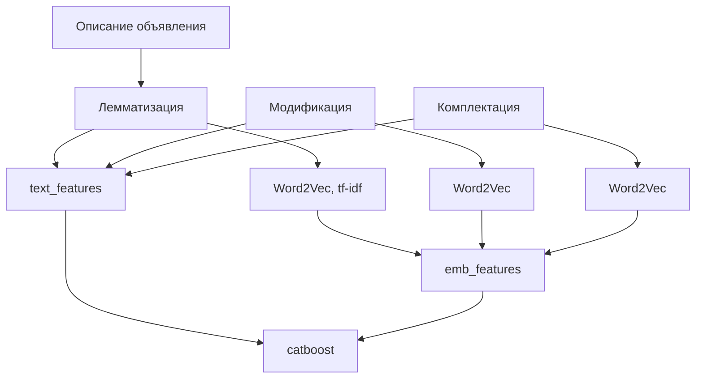
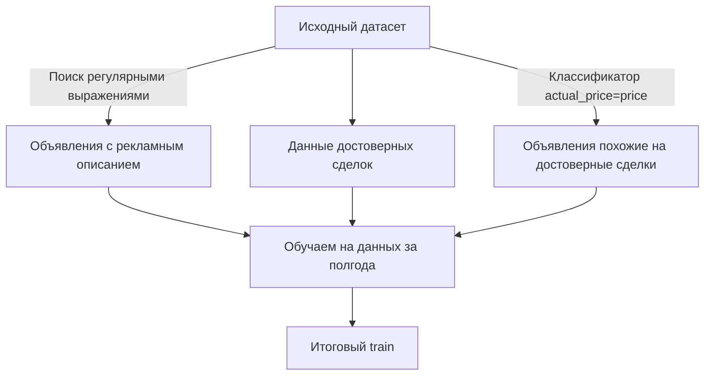
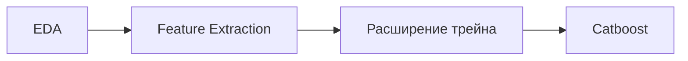
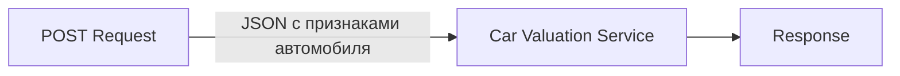

# CarValuationService

|                  |                                                   |
|------------------|---------------------------------------------------|
| Команда          | **TopGear**                                       |
| Состав           | [Александр Рыжков](https://github.com/ryzhkov9601) [Максим Хатин](https://github.com/Sinus2x) [Иван Литвинов](https://github.com/Litvinov-Ivan) |
| Название проекта | **Улучшение оценки стоимости авто**               |

## Мотивация

Оценка авто призвана сделать рынок продажи автомобилей более прозрачным и понятным: 
1. Указание рыночной цены позволит продавцам быстрее закрывать сделку и не упускать потенциальную выручку.
2. Покупателям адекватная оценка помогает избежать переплат и быстрее найти подходящий вариант.
3. Улучшение оценки должно привести к увеличению репутации сервиса, а следовательно - влияет на конверсию и количество объявлений на платформе. 
 Таким образом, в справедливой цене заинтересованы не только покупатели и продавцы, но и сама компания Авито.

## Метрики

Были выбраны следующие метрики:
- Бизнес-метрики
  1. Уменьшение среднего времени закрытия объявления - знак того, что оценка следует рынку.
  2. В случае оптимальности оценки будет расти репутация площадки, а значит и количество объявлений в разделе авто.
  3. Прокси-метрикой также может служить увеличение случаев, когда предлагаемая продавцу цена при подаче объявления будет совпадать с ценой в опубликованном объявлении.
- ML-метрика
  1. Так как цены машин разнятся от 50 т.руб. до 20 млн.руб., то для честного сравнения точности предсказаний используем процентную ошибку. Также среди очень дешёвых и очень дорогих машин наблюдается сильный разброс цен, поэтому в качестве среднего возьмём медиану, поскольку она не учитывает выбросы: 
$$MedianAPE=median(\cfrac{|y_{predicted} - y_{true}|}{y_{predicted}})$$

## Исходные данные

- 1.4 миллиона объявлений о продаже автомобилей за 2022 год
- Временная структура
- 2 источника данных - автодилеры и физические лица
- Только около 5% объявлений имеют достоверные данные о цене закрытия сделки
- 70 признаков:
  1. Числовые - пробег, возраст, цена в объявлении и т.д.
  2. Геолокация
  3. Даты сделки, размещения автомобиля
  4. Текстовое описание объявления
  5. Категориальные - бренд, модель, модификация и т.д.
  6. Мультикатегориальные - оснащение, повреждения и т.д.
- Б**о**льшая часть признаков сильно разрежена

## Оценка решения задачи
В качестве nonML-бейзлайна была выбрана группировка по основным категориям - модель, бренд, поколение, модификация. Преимуществом данного метода является его низкие накладные расходы и простота, такое решение даёт нам следующий baseline: 
$$MedianAPE=9\\%$$
Задача решалась методом **градиентного бустинга**, основным направлением улучшения как бейзлайна так и существующего сервиса было:
- упрощение пайплайна; 
- применение текстовых описаний.

## Текстовые признаки

## Обучающая выборка

## Пайплайн решения и итоговая метрика

$$MedianAPE=6.3\\%$$
Замер метрики происходил по скрытой выборке, получен прирост в точности в **1.5 раза**.
## Feature importances

## Реализация сервиса

Технические требования к исполнению сервиса были поставлены следующие:
- 99 перцентиль времени ответа ≤150 ms при нагрузке 1500 rpm 

В итоге сервис реализован с помощью FastAPI в виде endpoint "ручки":
- По POST запросу принимается запрос от пользователя на получение оценки стоимости.
- Полученный в запросе JSON обрабатывается, все необходимые признаки приводятся к требуемой для модели форме.
- Модель делает предсказание.
- Сервис возвращает отклик с предсказанной моделью ценой автомобиля.
- Параллельно statsd собирает метрики, которые передаются в graphite, откуда Grafana формирует дашборд для мониторинга.
- Запросы пользователей эмулируются с помощью locust, при нагрузке в 30 RPS (что соответствует 1860 rpm) 99% перцентиль отклика укладывается в требуемый диапазон.

## Запуск
`git clone https://github.com/Sinus2x/CarValuationService.git`  
`cd ./CarValuationService`  
`docker volume create --name=grafana-volume`  
`docker-compose up -d`

Сервис доступен по http://0.0.0.0:8000/docs, где во вкладке `/predict` можно протестировать запрос на оценку стоимости машины.
Примеры запросов есть в [experiments/car_inference_test.txt](experiments/car_inference_test.txt)

| Название | Адрес                    |
|----------|--------------------------|
| Сервис   | http://0.0.0.0:8000/docs |
| Локуст   | http://0.0.0.0:8089      |
| Графана  | http://0.0.0.0:3000      |

## Структура репозитория

| Название папки                                   | Значение                                                                |
|--------------------------------------------------|-------------------------------------------------------------------------|
| [car_valuation_service](car_valuation_service/)  | Код сервиса                                                             |
| [eda](eda/)                                      | Ноутбуки с EDA                                                          |
| [experiments](experiments/)                      | Ноутбуки с обучением модели                                             |
| [metrics](metrics/)                              | Обоснование выбора метрик и схема решения                               |
| [motivation](motivation/)                        | Оценка проекта до взятия в работу                                       |
